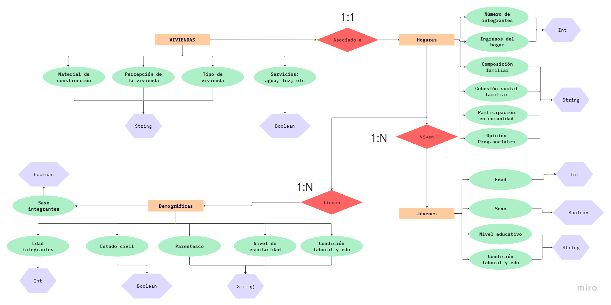

# Base de Datos Relacionales
## Tarea 2
### Instrucciones

- Convierte tu base de datos no estructurada en un modelo entidad-relación, representándolo con un diagrama entidad-relación. Usa nodos con figuras correctas y aristas claramente señaladas con los números correspondientes para las relaciones. 
- Muestra el dominio de los atributos.
- Subir esta descripción en un archivo markdown o PDF nombrando claramente (Tarea 2 o algo por el estilo).

### Diagrama entidad-relación

### Relaciones representadas en el diagrama:
- **Hogares - 1:1 - Viviendas**
Cada hogar está asociado a una sola vivienda

- **Hogares - 1:N - Jóvenes**
En un hogar pueden vivir varios jóvenes

- **Hogares - 1:N - Demográficas**
Un hogar puede tener múltiples integrantes con carácteristicas demográficas

### Dominio de los atributos por entidad

**1) Viviendas**
- Tipo de vivienda. *[string]*
- Material predominante de techo, muros y pisos. *[string]*
- Servicios como agua, luz, drenaje, servicio de recolección de basura. *[boolean]*
- Equipos del hogar (refrigerador, lavadora, computadora). *[boolean]*
- Percepción de la vivienda (seguridad, acceso a servicios públicos). *[string]*

**2) Jóvenes:**

Contiene información sobre los jóvenes. Dentro de ella se pueden encontrar datos de: 
- Edad. *[int]*
- Sexo. *[boolean]*
- Nivel educativo. *[string]*
- Condición laboral y educativa (trabaja, busca trabajo, estudia). *[string]*
- Participación en organizaciones. *[string]*
- Experiencia con violencia, delitos y consumo de sustancias.*[string]*

**3) Hogares:**

Esta categoría permite identificar condiciones del hogar. 
- Número de integrantes en el hogar. *[int]*
- Composición familiar. *[string]*
- Ingresos totales del hogar. *[int]*
- Percepción de cohesión social familiar. *[string]*
- Participación en comunidad. *[string]*
- Opinión sobre los programas sociales. *[string]*

**4) Demográficas:**

Agrupa información general de los individuos que viven en el hogar: 
- Edad de los integrantes del hogar *[int]*
- Sexo *[boolean]*
- Parentesco con los jefes del hogar *[string]*
- Estado civil *[boolean]*
- Nivel de escolaridad *[string]*
- Condición de actividad (trabajando, buscando trabajo,estudiando) *[string]*