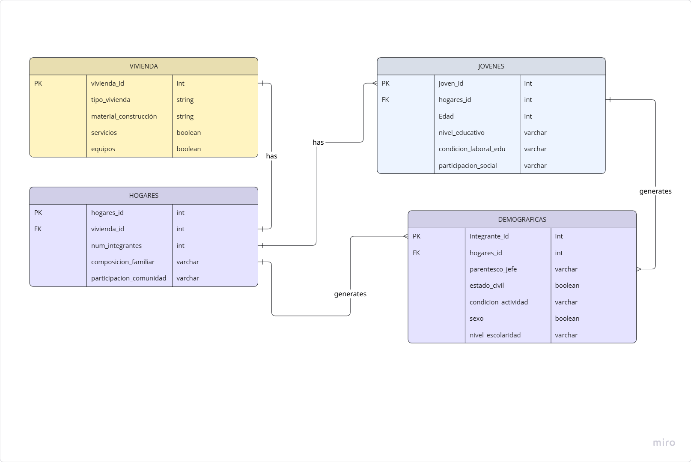

# Base de Datos Relacionales
## Tarea 3
### Instrucciones
- Crea un esquema del modelo relacional de tu base de datos a partir del modelo entidad-relación de la tarea anterior.
- Representa con un diagrama relacional tu esquema del punto anterior.
- Encuentra cuatro operaciones que vayas a usar en tu base de datos y expré salas mediante operaciones de álgebra relacional. Explica con tus propias palabras cada una de esas operaciones.

### Esquema modelo relacional.


### Modelo relacional

**Vivienda** 
```postgresql
(vivienda_id *INT PRIMARY KEY*, tipo de vivienda *varchar*, material_construccion *varchar*, servicios *boolean*, equipos *boolean*)
```

**Hogares** 
```postgresql
Hogar(hogar_id *int primary key*, vivienda_id *int foreign key*, num_integrantes *int*, composicion_Familiar *varchar*, participacion_comunidad *varchar*)
```

**jovenes**
```postgresql
jovenes(jovenes_id *int primary key*, hogares_id *int foreign key*, edad *int*, nivel_educativo *varchar*, condicion_laboral_Edu *varchar*, participacion_social *varchar*)
```

**Demograficas**
```postgresql
Demograficas(integrante_id *int primary key*, hogares_id *int foreign key*, parentesco_jefe *varchar*, estado_civil *boolean*, condicion_actividad *varchar*, sexo *boolean*, nivel_escolaridad *varchar*)
```
### Algebra relacional

**1) Selección**
σ_nivel_educativo = 'Universidad' (JOVENES)

*Explicación*: Filtra la tabla jovenes para quedarse únicamente  con los registros donde el nivel educativo sea universidad.

**2) Proyección**
π_tipo_vivienda (VIVIENDA)

*Explicación*: Extrae únicamente la columna tipo_vivienda de la tabla vivienda, eliminando duplicados.

**3)Join natural**
JOVENES ⨝_hogares_id=hogares_id HOGARES

*Explicación*: Une las tablas jovenes y hogares usando el campo en común hogares_id, combinando sus atributos.

**4) Combinaciones**
σ_num_integrantes > 5 (VIVIENDA × HOGARES)

*Explicación*:Primero crea todas las combinaciones posibles entre viviendas y hogares y luego filtra solo las filas donde hay más de 5 integrantes en el hogar.


#### Materiales de aprendizaje: 
En esta sección incluyo todos los materiales (videos, artículos y documentación) que consulté mientras trabajaba en esta tarea. Los mantengo como referencia para mi yo del futuro. 

**Aprendizaje: Cómo hacer un diagrama Entidad Relación**

Lucid Software. (2018). Tutorial - Diagrama Entidad-Relacion (ER) [Video]. Youtube. https://youtu.be/TKuxYHb-Hvc?si=j1prEr8QrZDJjY5h